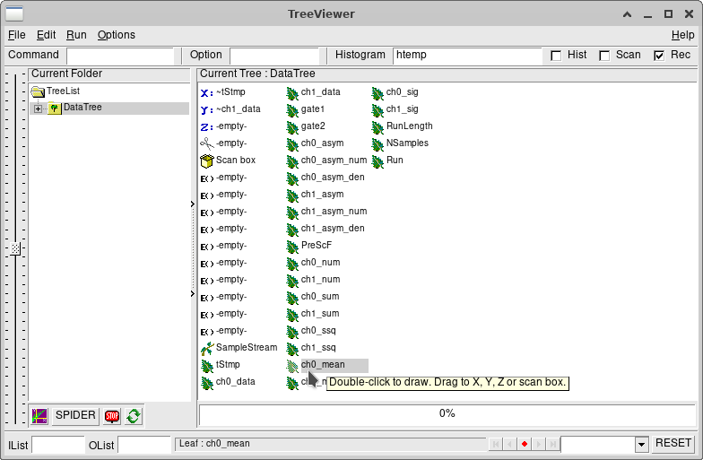

# Software Front-end for testing the MOLLER/P2 Integrating Electronics Prototypes 

## This was successfully compiled with

* Ubuntu 22.04.3 LTS
* 6.2.0-34-generic
* ROOT 6.28/06 with all required and recommended support programs
* libzmq3-dev (note: the new version of the firmware/software uses the zmq_poller routines, which are still only part of the draft version of zmq for C/C++. To get it to work, I had to download the source and compile the zmq lib from scratch, with #define/#endif ZMQ_BUILD_DRAFT_API in the zmq.h source commented out. The CMakeLists.txt file for this version uses the specific directory where I installed that compiled library. You will have to do the same and change the directory for zmq in the CMakeLists.txt, if you install it in a different directory.)
* There are two different executables in this package.
* The interface program CMMonitor that uses the ROOT graphical user interface components (TG*) and ...
* The new CMData program, which is an example of how to use the code without the GUI

## Project Layout

* /lib - Previously written data display utility library
* /include
* /source
* /PythonSoft - Original python scripts written by Bryerton Shaw @ TRIUMF
* /Firmware   - up-to-date firmware written by Bryerton Shaw @ TRIUMF

## Setup

* 'mkdir <some directory>'
* 'cd <some directory>'
* clone the repository
* 'cd lib'
* 'mkdir build'
* 'cd build'
* 'cmake ..'
* 'make'
* 'cd ../..'
* 'mkdir build'
* 'cd build'
* 'cmake ..'
* 'make'
* cp CMMonitor ..
* cp CMData ..
* cd ..

## Running CMMonitor

* './CMMonitor' (without commandline arguments - connection can be set via menu)
* Follow these steps:
* Set the ip address from the menu (only has to be done ones when the address changes)
* The run number, run time, prescale, ch0, ch1 setting are read from the CMMonitorSettings.txt file. Adjust those as needed (see below). These are also stored after you change the corresponding values in the GUI.
* Select "Connect" (MUST BE DONE AFTER ALL OF THE ABOVE INFORMATION IS ENTERED) from the "Data" menu and then press "Start"
* The program also has the ability to take multiple runs at a time. The number of runs can be specified at right end of the toolbar.
* Data is added to all histograms cummulatively (except in multi-run mode) so plots can get very large and slow to load (in ROOT). The "Clear Plots" button resets the data in the ROOT plots. It does not clear the actuall data writtent to file, which happens very quickly after the "Start" of the run.
* I recommended using this program mostly just for very short runs or short sequence of runs, to quickly check if one gets correct data output. See below for CMData, to collect long sets of runs.

### Menus

* File/Open(Data File): Read in a previously taken run
* File/Save(Settings): Modifies the CMMonitorSettings.txt file with the options that are currently entered in the Toolbar. Caution: This overrides the information about the last raken run in that diectory.
* Data/Set IP: Set the ip address of the ADC board here
* Data/Connect: Connects the board to the ADC
* Data/Stop: Force stops the data taking process

### Inputs and Buttons:

* Run: Run number - incremented automatically after the run is taken and stored in CMMonitorSettings.txt
* Run Time: Number of second length of the run. Note that the runs should be very short (a few seconds at most), since a lot of data is currently written, depending on the sampling rate. Depending on the network speed (currently only copper Eth0) there could be gaps in the data if the run is too long, unless the rate is decereased with "Prescale".
*Prescale: The sampling rate of the ADC is 14705883 Smpls/sec and currently every sample is taken and transferred. The Prescale setting allows to decrease the number of buffered and transferred samples. A Prescale=2 means only every other sample is buffered and transferred. If the network connection or the computer running this software is not fast enough, not all buffered samples will be transferred in time, before the buffer is overwritten on the FPGA SoM. So gaps may occur in the colleced data. For normal computers and network connections a larger prescale factor will prevent this (of course also reducing the available bandwidth information).
*Ch0/Ch1: Set the two channels to be read out simultaneously (both can be chosen between 1-16). Currently at most two channels can be read out at the same time, again, due to speed limitations, but all channels on the 16 channel ADC board are operational.
*Start: Start a run after selecting "Connect" from the "Data" menu. The run only takes a short moment to be written to file (binary file), but filling the ROOT plots may take a little longer. The histogram shows the progrss.
* Time Graph: Generates plots of the data as a function of time (from the sample timestamp in each run)
* Histo (HR): Generates a higher resolution histogram of the data. Same as the one that is filled at first, but with a higher bin resolution
* FFT: Generates the FFT of the data
* Clear Plots: Clear the plots and resets them to zero. Can be used if things take too long to plot.

## Running CMData

* './CMData -l <..> -n <..> -s <..> -c1 <..> -c2 <..> -r <..> -red'
* This is simple command-line program that collects a (or squence of) run according to the parameters set with the commandline switches. The program produces a binary file output of the data packets that can be read in later with the CMMonitor program or some other custom program, as well as a ROOT file containing a TTree data structure with all of the relevant run information.
*It is not required to specify any commandline arguments. If non are given, the program reads the parameters from a files called "CMDataSettings.txt". If there is no such file and no flags are set, the program selects a standard set of initial settings. At the end of the run(s) the program writes the setting to the "CMDataSettings.txt" file, including the ones that were specified on the command line. The latter superseed and replace the paraemters listed in the settings file. The settings file therefore always starts off rom the last used set of parameters.

### Command-line arguments

* '-l <length in seconds>' :  Specifies the length of an individual data run
* '-n <number of runs>'    :  Specifies the number of data runs to be taken
* '-s <prescale factor>'   :  Specifies the the number of skipped samples in the readout (e.g. 4 means every 4th samples is read out.) The minimum values is 1. A reasonabe range is up to e.g. 10. 
* '-c1 <channel number 1>' :   Specifies the first of the 1-16 board channes for simultaneous streaming readout
* '-c2 <channel number 2>' :   Specifies the second of the 1-16 board channels for simultaneous streaming readout
* '-r <starting run number>' :  Specifies the starting run number in the sequence. Note that the program normally keeps track of the run numbers within a directory and update the next run number in the settings file. It will overwrite runs with the same run number if one specifies a run number with this switch, if it already exists.
* '-red' : Reduces the ROOT file output, by only writing the average values within the gate, not every sample. 

## Notes

* It is recommended to keep the ratio '-l/-s' for each run small, to limit the file size (they become very large very quickly).
* Each binary data run (packet data) is currently written in that program as an individual file, but the data is combined into a single ROOT file, over the entire sequence of runs. So that can make the ROOT files large. This is easy to change though, by adapting the code correspondingly.
* The data items that are currently written to the ROOT tree are shown below.

## Hardware

This program looks for the 16 ADC board with the specified ip address. The board should be powered and booted, which
it does normally on power on. Look for the 4 vertical LEDs pattern at the front of the board, which
should be [on,on,off,on] from top to bottom. This pattern means the board booted correctly.

### Data Rate

The data rate from the FPGA board is very high, currently only being read out in streaming mode.
So the graphs in the program should be reset afer a while, but the data is written to a binary file. Nonetheless, the files become very large if runs are too long.

### Firmware

Presently, the easiest way to load the firmware and boot the SoM, is with an SDcard that can be inserted on the side and underneath the SoM module.
The 

1. Making an SDcard image (Warning: Assumes /dev/sdb is an SDcard!)

   1. `sudo parted /dev/sdb --script -- mklabel msdos`
   2. `sudo parted /dev/sdb --script -- mkpart primary fat32 1MiB 257MiB`
   3. `sudo parted /dev/sdb --script -- mkpart primary ext4 257MiB 100%`
   4. `sudo partprobe /dev/sdb`
   5. `sudo sync`
   6. `sudo mkfs.vfat -F32 /dev/sdb1`
   7. `sudo fatlabel /dev/sdb1 ${SDCARD_BOOT_LABEL}`
   8. `sudo mkfs.ext4 -L ${SDCARD_ROOTFS_LABEL} /dev/sdb2`
   9. `sudo sync`

2. Copy files to SDCard
   
   1. `unzip -p ${SDCARD_ZIP} BOOT.BIN >/media/${USER}/${SDCARD_BOOT_LABEL}/BOOT.BIN`
   2. `unzip -p ${SDCARD_ZIP} boot.scr >/media/${USER}/${SDCARD_BOOT_LABEL}/boot.scr`
   3. `unzip -p ${SDCARD_ZIP} Image >/media/${USER}/${SDCARD_BOOT_LABEL}/Image`
   4. `unzip -p ${SDCARD_ZIP} rootfs.cpio.gz.u-boot >/media/${USER}/${SDCARD_BOOT_LABEL}/rootfs.cpio.gz.u`
   
Notes:

   * Replace ${SDCARD_ZIP} with the name of the zip file (currently moller_20230712.zip)
   * Replace ${USER} with your usename in linux
   * Replace ${SDCARD_BOOT_LABEL} with BOOT
   * Replace ${SDCARD_ROOTFS_LABEL} with PETALINUX
